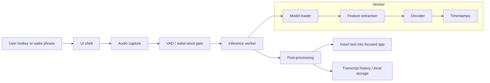
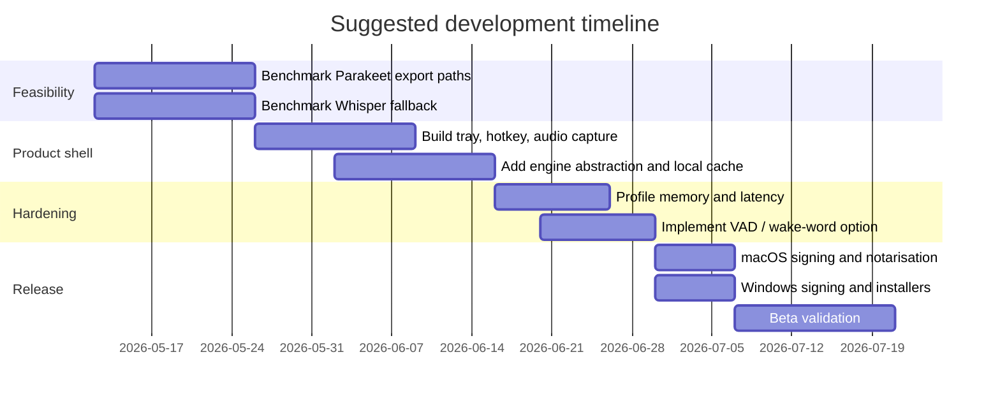

# Building a Cross-Platform Offline Desktop Speech-to-Text App with Parakeet v3

## Executive summary

Parakeet-TDT 0.6B v3 is a serious candidate for an offline desktop speech-to-text product: the official model card describes it as a 600-million-parameter multilingual ASR model covering 25 primarily European languages, with automatic punctuation and capitalisation, word/segment timestamps, long-form transcription support, and a permissive CC BY 4.0 licence suitable for commercial use. The same model card, however, also makes an important deployment point easy to miss: the first-party runtime story is NeMo 2.2 with preferred Linux support and a GPU-centric hardware matrix, not a turnkey macOS/Windows desktop runtime. In practice, that means Parakeet v3 is attractive on model quality and language coverage, but comparatively risky on packaging and portability unless you adopt an export path such as ONNX or rely on community-maintained ONNX conversions. citeturn12view0turn12view1turn13view0turn13view4turn12view3turn14search10turn14search2

For a product that must ship well on both macOS and Windows, the most robust architecture is a thin desktop shell plus an isolated local inference worker. If Parakeet v3 is a hard requirement now, the pragmatic route is usually Tauri or Qt on the front end, with ONNX Runtime or a Python/Rust/C++ sidecar behind a stable IPC boundary. If schedule risk matters more than squeezing out the best multilingual model fit on day one, a Whisper-family stack remains the lower-risk baseline because the runtime ecosystem is far more mature across CPU, Metal, CUDA, Vulkan, OpenVINO, and generic desktop packaging. citeturn12view3turn12view4turn12view6turn12view5turn16search22turn8search0turn20search1

My recommendation is therefore two-track. Build the product shell and audio pipeline around a pluggable engine contract. Use that contract to ship a low-risk baseline first, then bring Parakeet in behind a feature flag once you have proved export quality, memory behaviour, and installation size on representative Macs and Windows PCs. That preserves product momentum while keeping Parakeet available as the likely “premium multilingual” engine. citeturn14search10turn14search2turn15search28turn14search4turn15search7

## Model selection and trade-offs

Parakeet v3’s official documentation is strong on capabilities and weak on cross-platform deployment guarantees. The model card states that it is based on FastConformer-TDT, takes 16 kHz mono `.wav` or `.flac`, supports timestamps, and needs at least 2 GB of RAM merely to load; it also lists long-form support up to roughly 24 minutes with full attention on an 80 GB A100, or up to about 3 hours with local attention. The same documentation tags the model as NeMo/PyTorch/Safetensors on Hugging Face and points users to NeMo installation for first-party use. That combination is a signal that the “official” artefact is a training/inference checkpoint in the NeMo ecosystem, not a first-party desktop-oriented ONNX, Core ML, GGML, or WebGPU package. citeturn12view1turn13view0turn13view2turn13view4

NeMo’s export documentation materially changes the outlook because it says exportable NeMo models can be emitted as ONNX or TorchScript for deployment in optimised inference environments. That is the opening you need for a real desktop product. The catch is that NeMo’s documentation is framework-level and does not amount to a product-style promise that Parakeet v3 is frictionless on every desktop target. Community work has already filled some of that gap: there are ONNX conversions of Parakeet v3 on Hugging Face, the `onnx-asr` project supports Parakeet-family ONNX models, and recent community Rust implementations report good CPU performance on modern Macs and Windows machines. That makes Parakeet technically feasible cross-platform, but today it is still more of an engineering programme than a drop-in desktop dependency. citeturn12view3turn14search10turn14search2turn14search1turn14search32

The most relevant alternatives are not just “other models”, but whole model-and-runtime ecosystems. Whisper large-v3 remains the safest benchmark because it is widely supported, well understood, and available through several efficient local runtimes. Distil-Whisper cuts size and latency substantially while staying close to Whisper accuracy, especially in English pipelines. Moonshine and Moonshine v2 are explicitly designed for live transcription and voice-command latency. SenseVoiceSmall is attractive if you care about multilingual ASR plus emotion/event detection. Canary-1B-v2, from the same research line as Parakeet v3, is stronger when you also want speech translation, but it is larger and currently less convenient for the ONNX-style desktop path. citeturn18search12turn18search0turn18search8turn18search3turn18search7turn18search1turn18search2turn12view2

### Practical model matrix

| Model family | Accuracy / latency profile | Size / language profile | CPU / GPU support in practice | Best fit |
|---|---|---|---|---|
| Parakeet-TDT 0.6B v3 | Strong multilingual quality; good timestamps; fast enough to be product-grade if exported well | 600M parameters; 25 European languages; commercial-friendly CC BY 4.0 | Officially strongest in NeMo/Linux/GPU flows; community ONNX paths broaden CPU/macOS/Windows support | Multilingual dictation or transcription where you can afford integration work |
| Canary-1B-v2 | Higher-capability ASR/AST line; paper reports very strong English ASR | Larger than Parakeet; oriented to ASR plus speech translation | Better suited to heavier local GPU workflows than lightweight desktop shipping | Advanced transcription/translation workstation apps |
| Whisper large-v3 | Very strong general baseline; slower/heavier than distilled or lightweight options | Large multilingual model | Excellent ecosystem support through whisper.cpp, faster-whisper, Transformers and others | Lowest engineering risk, especially for first release |
| Distil-Whisper | Major speed-up and smaller footprint with limited quality loss | Roughly half the footprint reduction versus Whisper large; strongest story in English pipelines | Broad Whisper ecosystem support, especially in faster-whisper | Fast English dictation/transcription |
| Moonshine / Moonshine v2 | Latency-first family built for live transcription and commands | Smaller/faster design goal than large general-purpose ASR models | Promising for CPU-edge style use cases | Live captioning and command-centric UX |
| SenseVoiceSmall | Very low-latency design with extra audio understanding tasks | Broad multilingual claims plus emotion/event features | Good deployment story through its repo and ecosystem, but evaluate carefully for your language mix | Voice interfaces that need more than plain transcription |

The table above is deliberately qualitative rather than pretending there is one universally meaningful leaderboard. The official Parakeet model card provides multilingual WERs and an Open ASR leaderboard average of 6.34; the Distil-Whisper authors report it is 49% smaller, around 6x faster, and within about 1–1.5% WER of Whisper large on their evaluated sets; Moonshine papers are explicitly framed around live transcription and low-latency use; SenseVoiceSmall’s repo and model card emphasise low latency and broad multilingual coverage. In a desktop product, these architectural facts often matter more than chasing one benchmark number. citeturn13view2turn13view4turn18search0turn18search8turn18search3turn18search7turn18search1turn18search2

If I were selecting the engine specifically for a 2026 macOS/Windows desktop product, I would frame the decision like this. Parakeet v3 is a good candidate when European multilingual coverage, punctuation, timestamps, and local privacy are central product features. Whisper-family stacks are better when you need maximum implementation certainty, especially with CPU support and packaging. Distil-Whisper is the strongest “performance-first English” option. Moonshine is worth exploring when perceived latency matters more than multilingual breadth. SenseVoice is most interesting when “transcription” is only one part of the audio UX. citeturn13view2turn12view6turn12view5turn18search8turn18search3turn18search1

## Frameworks, installers, signing, and release engineering

Three packaging concepts matter enough to define plainly. **Code signing** is the cryptographic signature that tells the OS who built the binary and whether it has been altered. **Notarisation** on macOS is a platform security check that scans Developer ID-signed software and issues a ticket so Gatekeeper will trust it more smoothly. **AppContainer** on Windows is a lightweight sandbox mode available to certain packaged apps, limiting what the process can touch unless explicitly granted. Those security mechanics are not “nice to have” details for desktop AI apps; they directly affect installation friction, update flows, and whether global hotkeys, microphone access, and helper processes behave the same in development and production. citeturn5search0turn8search7turn8search8turn5search2turn5search4turn9search15

### Framework comparison

The table below uses relative labels. “Binary size” is about the shell and runtime strategy, not the model file itself; an offline STT model will often dominate the total install size.

| Framework | Platform support | Binary size | Dev complexity | Performance | Security |
|---|---|---|---|---|---|
| Electron | macOS, Windows | Large | Low for web teams | Good enough for UI; inference should live outside the renderer | Moderate by default, strong only if you enforce context isolation, sandboxing, strict IPC, and minimal preload exposure |
| Tauri | macOS, Windows | Small | Medium | Strong UI performance; excellent with native sidecar/worker design | Strong, thanks to narrow Rust core, capabilities, and permission scoping |
| .NET MAUI | Windows, macOS via Mac Catalyst | Medium | Medium | Good for C# teams; strongest when inference is in C#/C++ rather than Blazor-heavy UI | Moderate to strong, depending on platform packaging and capabilities; Mac side is Catalyst rather than pure AppKit |
| Qt | macOS, Windows | Medium to large | Medium to high | Excellent native performance and audio/control fidelity | Strong if carefully packaged; less “secure by default” than Tauri-style permission systems |
| Swift + WinUI dual native shells | macOS and Windows, but with separate UIs | Medium | Very high | Excellent | Excellent native control, but highest maintenance cost |

These judgements follow directly from the official architectural descriptions. Electron embeds Chromium and Node.js, which is why it is productive but comparatively heavy; its own security guide recommends context isolation and sandboxing. Tauri uses the system webview and a Rust-based core, and its v2 documentation centres security around capabilities and scoped permissions. .NET MAUI is genuinely cross-platform, but on macOS it is Mac Catalyst rather than a full AppKit-native UI stack. Qt gives you mature native desktop deployment tooling and excellent control over media and threading, but you must do more of the sandboxing and privilege design yourself. Swift is officially supported on Windows as a language and interoperates with C++, but pairing Swift on macOS with WinUI on Windows is effectively a shared-core, dual-shell strategy rather than a true shared-UI framework. citeturn16search38turn9search4turn9search8turn16search22turn10search18turn10search2turn4search11turn19search24turn8search0turn19search17turn17search21turn17search2turn17search1

If the product is web-team led and you need the fastest first milestone, Electron is still viable, but I would not run inference directly in the renderer process. If the product is privacy-first, performance-sensitive, and you want a smaller install footprint, Tauri is usually the better webview framework. If the team is already deep in C# and Windows desktop development, .NET MAUI is viable, but it is a more natural fit for business-app style UX than for low-level system integration. If you care most about native desktop behaviour, audio handling, worker control, and long-term stability, Qt is the strongest technical platform. citeturn16search38turn20search1turn19search24turn8search0

### Installers, signing, and notarisation

On macOS, software distributed outside the App Store should be signed with Developer ID and notarised; the platform documentation also prefers signed DMG or signed installer package distribution rather than casual ZIP shipping. Tauri can build `.app` bundles and DMGs directly; Qt’s `macdeployqt` can package an app, produce a DMG, and enable the flags needed for notarisation; .NET MAUI Mac Catalyst can be published as `.app` or `.pkg` and must be notarised for outside-App-Store distribution. citeturn5search0turn8search11turn20search4turn20search8turn20search2turn19search15turn8search1

On Windows, the cleanest modern story is usually MSIX plus Store distribution if your product can accept that channel, because Store-submitted MSIX packages are re-signed for you. Outside the Store, SignTool remains the basic signing tool, while current platform guidance increasingly points developers toward Azure Artifact Signing / Trusted Signing. Tauri produces MSI or NSIS installers; WinUI is packaged-first and works naturally with MSIX; Qt and Electron normally lean on custom installers, which means you are responsible for Authenticode signing and reputation-building. If your app depends on WebView2, plan the runtime story explicitly: Windows 11 includes the Evergreen runtime, while Windows 10 and managed environments may need a bootstrapper or offline installer strategy. citeturn5search2turn5search1turn5search4turn20search3turn4search5turn4search15turn16search1turn16search25

### Typical build and packaging commands

The following commands reflect the official tooling paths and are the ones worth automating in CI first. citeturn20search0turn20search1turn20search2turn19search2

```bash
# Electron Forge
npx create-electron-app@latest my-app --template=webpack
cd my-app
npm start
npm run make
```

```bash
# Tauri
npm run tauri build
npm run tauri bundle -- --bundles app,dmg
npm run tauri bundle -- --bundles msi
```

```bash
# Qt
cmake -B build -DCMAKE_BUILD_TYPE=Release
cmake --build build --config Release
windeployqt path\to\MyApp.exe
macdeployqt MyApp.app -dmg -sign-for-notarization="Developer ID Application: Your Name"
```

For a shipping macOS build, also script notarisation and stapling with `notarytool` and `stapler`; for Windows, script signing and timestamping with SignTool or the managed signing service you choose. Those steps should be treated as part of every release, not as a final-week manual chore. citeturn8search1turn5search1turn5search4

## Runtime integration patterns and architecture

The cleanest mental model is to separate the app into four layers: **UI shell**, **audio capture**, **speech pipeline**, and **text insertion/output**. “IPC” means the messages that cross a process boundary between those layers. In a desktop STT app, IPC is useful because it lets you isolate model crashes, hide large native dependencies from the UI process, and restart the engine without taking down the whole application. For Parakeet specifically, that isolation is especially valuable because the first-party usage path starts in Python/NeMo, while the most practical cross-platform shipping path often ends in ONNX Runtime, Rust, or C++. citeturn16search2turn16search7turn10search18turn12view3turn11search2turn11search7



There are four viable integration patterns. **In-process native runtime** is best when the UI shell is already native, such as Qt or WinUI, and you want minimum IPC overhead. **Bundled sidecar** is the most practical pattern for Parakeet because you can ship a separate worker built in Python, Rust, or C++ and keep the shell small and stable. **Loopback local service** can work for multi-window clients or automation, but it is more work to secure. **WebGPU/WebAssembly in the embedded webview** is improving, but for 600M-class STT models it is still a second-choice production path on desktop compared with a native worker. citeturn16search2turn16search7turn16search31turn6search3turn15search14

### Runtime comparison

| Runtime family | Platform support | Binary size | Dev complexity | Performance | Security |
|---|---|---|---|---|---|
| ONNX Runtime | macOS, Windows, Linux | Small to medium | Medium | Excellent, especially with DirectML, CoreML, CUDA, TensorRT or CPU EP tuning | Good, with small native footprint and broad language bindings |
| PyTorch / LibTorch / NeMo | macOS, Windows, Linux, but model-specific support varies | Large | Low for research, higher for shipping | Excellent on supported GPU setups; weaker packaging ergonomics | Moderate when embedded directly; Python sidecars increase dependency surface |
| TensorFlow Lite / LiteRT | Cross-platform | Small to medium | High if the model is not born in the TensorFlow family | Good to excellent for on-device inference when operator coverage fits | Good |
| GGML / whisper.cpp | macOS, Windows, Linux and more | Small | Low to medium | Excellent for Whisper-family inference, especially CPU and Apple hardware | Good, thanks to compact native code and simple embedding model |
| WebGPU / ORT Web style path | Browser or webview on macOS/Windows | Small shell, but model still large | Medium to high | Improving, but less predictable than native runtimes for heavy ASR | Strong sandboxing, weaker system integration |

The runtime decision should be driven first by the model family. If you keep Parakeet, ONNX Runtime is the most promising cross-platform production runtime because it is explicitly built around cross-platform inference and hardware-specific execution providers. PyTorch/NeMo is the easiest way to prototype against the official model card, but it is not the easiest desktop shipping story. TensorFlow Lite is compelling for true edge deployment, but only if your model converts cleanly and operator support holds. For Whisper-family engines, whisper.cpp remains the benchmark for simple local embedding. citeturn12view4turn11search2turn11search5turn16search0turn11search3turn11search29turn12view6

A useful technical term here is **execution provider**: in ONNX Runtime, that means the hardware backend that actually executes the graph, such as CPU, DirectML, CUDA, TensorRT, CoreML, OpenVINO, or XNNPACK. This is one of the strongest reasons to prefer ONNX Runtime for a cross-platform desktop ASR engine: the API stays largely stable while the acceleration backend changes per device. On Windows, that often means CPU first and DirectML second; on macOS, CPU first and then CoreML only once validated on your exact model. citeturn12view4turn6search6turn6search18turn6search10

### Example loading paths

This is the shortest “official” way to load Parakeet v3 locally, directly from the model card’s NeMo usage. It is ideal for proof-of-concept work and regression testing against the reference model behaviour. citeturn13view2

```python
import nemo.collections.asr as nemo_asr

model = nemo_asr.models.ASRModel.from_pretrained(
    model_name="nvidia/parakeet-tdt-0.6b-v3"
)

result = model.transcribe(["sample.wav"], timestamps=True)[0]
print(result.text)
print(result.timestamp["segment"][:3])
```

If you decide to productise Parakeet rather than merely evaluate it, the next step is usually export. NeMo’s export documentation says exportable models can be written to ONNX or TorchScript, which is the key bridge into a Windows/macOS-friendly runtime. citeturn12view3

```python
import nemo.collections.asr as nemo_asr

model = nemo_asr.models.ASRModel.from_pretrained(
    model_name="nvidia/parakeet-tdt-0.6b-v3"
)
model.eval()
model.to("cpu")

# Illustrative export step; validate outputs carefully afterwards.
model.export("export/parakeet_v3.onnx")
```

Once you are on an ONNX artefact, the desktop embedding story becomes much cleaner. In C#, for example, ONNX Runtime’s `InferenceSession` can load a model directly from disk, and the current docs recommend the newer `OrtValue`-based API for lower garbage generation and better performance. citeturn16search4turn16search8

```csharp
using Microsoft.ML.OnnxRuntime;

using var options = new SessionOptions();
// Add DirectML / CUDA / CPU options here as needed.
using var session = new InferenceSession("models/parakeet_v3.onnx", options);

// Pre-processing, feature extraction and decoder wiring omitted here.
// In a real app, keep this session in a long-lived worker and feed it PCM chunks.
```

If you decide that Parakeet is too much integration risk for beta, a Whisper-family runtime gives you a much lower-friction fallback. whisper.cpp exposes a compact C-style API, supports integer quantisation, CPU-only inference, AVX on x86, NEON/Metal on Apple Silicon, Vulkan, CUDA and OpenVINO, and is already proven inside many offline desktop projects. citeturn12view6

## Performance, memory, and power management

The biggest engineering mistake in local desktop STT apps is treating “offline” as if it were synonymous with “always-on”. It is not. A well-behaved desktop product should run in at least three states: **idle** with only tray/hotkey infrastructure and perhaps VAD or wake-word active; **armed** with audio capture open but the heavy model still unloaded; and **recording/transcribing** with the full inference worker hot. That architecture reduces idle RAM, limits heat and fan noise, and avoids the impression that the app is constantly listening in a privacy-sensitive way. Local VAD libraries such as Silero VAD and wake-word libraries such as openWakeWord exist precisely to support that front-end gating pattern. citeturn19search0turn19search8turn19search1

A few optimisation terms are worth defining. **Quantisation** means storing or running weights at lower precision, such as int8 instead of fp32, to cut memory and often improve speed. **Pruning** means removing less important weights or channels. **Batching** means processing several chunks together to improve throughput, though it usually hurts perceived latency in live dictation. **Lazy loading** means not paying model initialisation cost until the user actually starts speaking. In practice, ONNX Runtime supports dynamic and static quantisation, while Whisper runtimes such as faster-whisper and whisper.cpp already expose very practical int8 and integer-quantised workflows. citeturn7search2turn12view5turn12view6

The performance direction is clear. For Windows, DirectML is the broadest “works on many consumer GPUs” backend in the ONNX world. For higher-end CUDA systems, CUDA or TensorRT usually wins if you can accept the dependency stack. On Macs, whisper.cpp has an unusually strong handheld story because it explicitly targets Metal and Apple Silicon. ONNX Runtime also supports CoreML, but for Parakeet-family models you should validate that path on real devices early rather than assuming all export/provider combinations will be stable. A sensible matrix for a first beta is therefore CPU everywhere, plus DirectML on Windows and a validated Apple-hardware acceleration path on macOS. citeturn6search6turn6search10turn6search29turn12view6turn6search18turn14search1

Memory management deserves equal seriousness. Keep one long-lived inference session per engine, not one per transcription request. Reuse buffers. Cap queues between capture, feature extraction, and decoding so the UI cannot outrun the worker and accumulate unbounded audio in RAM. ONNX Runtime’s APIs support shared/pre-packed weights containers, which are useful if you must recreate sessions or run more than one engine flavour without duplicating all preprocessing cost. If the model cannot stay resident comfortably on 16 GB machines alongside normal browser/editor workloads, ship it as an optional engine rather than the only path. citeturn11search9turn16search8

Profiling should be designed in from week one. On macOS, use Instruments, especially Time Profiler plus Allocations/Leaks, and use the Metal tools if you accelerate on GPU. On Windows, use the Visual Studio profiler for CPU and memory snapshots, then drop to WPR/WPA and ETW when you need system-wide traces for hangs, device contention, or worker leaks. Couple those tools with real transcription workloads, not synthetic micro-benchmarks, because insertion latency and UI responsiveness often matter more than raw tokens per second. citeturn6search12turn6search4turn7search11turn6search1turn6search5turn6search9turn6search34

For live products, one more distinction matters: **throughput** is not the same as **responsiveness**. faster-whisper’s own benchmarks show batching can improve total processing time dramatically, but at the cost of more memory and less incremental behaviour. That is excellent for transcribing long recordings and poor for hold-to-talk dictation. A production app should therefore expose different engine modes or profiles: “Live dictation”, “Meeting transcription”, and perhaps “High accuracy offline job”. Users understand those trade-offs intuitively if you label them in plain language. citeturn12view5

## Delivery plan and implementation references

The fastest way to de-risk this project is not to debate frameworks abstractly, but to run a disciplined feasibility sequence. In the first milestone, benchmark three engine paths on representative machines: Parakeet ONNX on CPU and DirectML, official Parakeet/NeMo on a supported GPU box, and a Whisper-family baseline such as whisper.cpp or faster-whisper. In the second milestone, finalise the desktop shell and text insertion UX. In the third, automate packaging, signing, and installation. Only after that should you optimise hotwording, meeting capture, or model download UX. citeturn14search10turn12view3turn12view6turn12view5



A rigorous technical recommendation for 2026 is this. If you want the best balance of shipping speed, binary size, and security, use Tauri for the shell and a native sidecar for inference. If you want the strongest long-term native desktop control, use Qt and keep everything in native code. Treat Electron as a productivity-first option, not as the technical default. Keep Parakeet v3 on the roadmap, but do not let its official runtime constraints dictate the whole product architecture; instead, build the product around an engine interface and allow Whisper-family or Moonshine-class fallbacks until Parakeet’s exported path is fully validated on your target machines. citeturn20search1turn16search2turn8search0turn16search38turn13view4turn12view3turn12view6turn18search3

For implementation work, the most useful starting references are the official docs and a small set of well-chosen community examples. Official references: urlParakeet v3 model cardturn12view0, urlNeMo export documentationturn12view3, urlONNX Runtime docsturn6search26, urlONNX Runtime C# tutorialturn16search4, urlwhisper.cppturn7search0, urlfaster-whisperturn2search0, urlsherpa-onnxturn14search33, urlTauri sidecar docsturn16search2, urlTauri distribution docsturn20search1, urlElectron Forgeturn20search0, urlQt macOS deploymentturn8search0, urlQt Windows deploymentturn19search2, url.NET MAUI Mac Catalyst publishingturn19search15, urlmacOS notarisation guidanceturn5search0, and urlWindows signing guidanceturn5search2. Community references that are worth studying but not blindly copying into production include urlonnx-asrturn14search2, urlParakeet v3 ONNX conversionturn14search10, urlJustDictateturn14search4, urlOpenWhisprturn15search28, urlFluidAudioturn15search7, urlGlimpseturn14search11, and urlvoxcodeturn14search25.